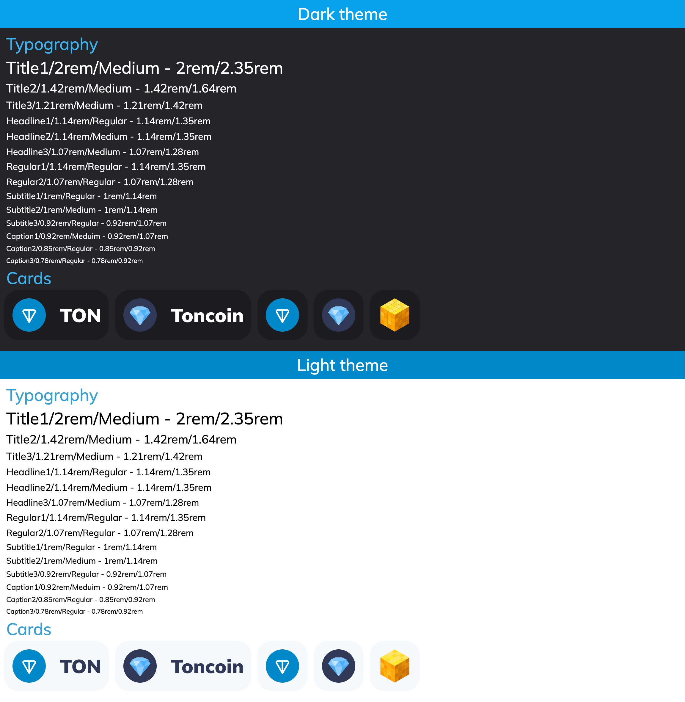

# TON Design System

https://ton.org/en/brand-assets

## Development environment

### Prerequisites

`node16.13.2`, `npm8.1.2`, `make3.81`

### Quick start

Install packages:

```zsh
npm i
```

Run `dev` (1) or `prod` (2) environment

1:

```zsh
npm run dev
```

2:

```zsh
make preview
npm run serve -- --host
```

`

## Main idea

Atomary CSS

```css
.atom {
  @apply ... (tw-classes)
}
```



## Usage package

Example of usage with [`vite-vanilla-ts`](https://github.com/designervoid/ton-design-system-vite-vanilla-ts)

## Troubleshooting with tests

Fix  

```zsh
npm cache clean --force
```

## License

MIT
